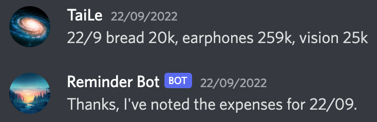
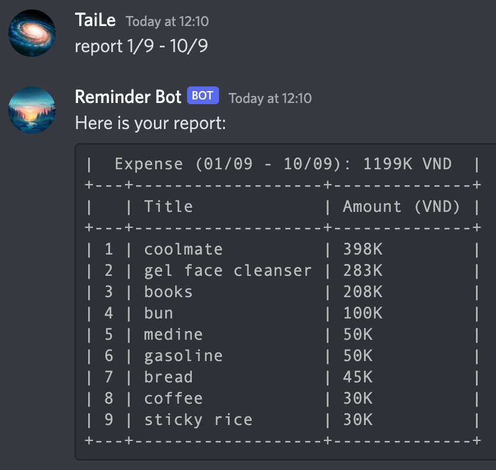

# Personal Assistant

This project was created in order to:

1. Remind me to read my favorite manga
2. Receive and summarize expense messages

I have no interesting ideas left to make it more useful, so please feel free to contact me if you have something to improve the bot.

### Technology

- Python
- Django
- MongoDB
- Puppeteer
- Cron Job
- Redis (Message Queue)
- Discord.py
- Heroku free server (Deprecated soon)


### Discord Bot Setup

There is a saying: "Don't reinvent the wheel". This means there are a lot of tutorial out there to set up a Discord bot, I don't need to do it again. When I was doing this project, I followed the tutorials below here to complete the task:
1. [Set up a Discord Bot](https://www.youtube.com/watch?v=j_sD9udZnCk)
2. [Send and receive message](https://www.youtube.com/watch?v=nTGtiCC3iQM)

In general, they have several steps:
1. Create an Application in Discord
2. Create a Discord Bot in the Application
3. Grant permissions to the Bot and attach it to a Discord Server
4. Put the Bot token to our Django server
5. Sign in using that token in our server


### Database Overview

Previously, I used PostgreSQL because Heroku provided a free plan with a limited record (10k records / table); but the free plan will end soon in November 2022. Therefore, I use MongoDB and MongoEngine as the ORM Framework because MongoDB supports a free plan (512MB - 5GB storage). You can read more about MongoDB pricing [here](https://www.mongodb.com/pricing).

There are some models to cover my need. Below are the models I use in this project, 
- **Expense**
- **ExpenseCategory**
- **Manga**
- **MangaChapter**
- **Message**


### Code Structure

- **src:**
  - **bots:** Contains bots of platforms like Discord, Slack
    - **discord:**
      - **cogs/redis_listener.py:** Command listening messages in Redis every second
      - **handlers/manga_release.py:** Handle MangaRelease messages in Redis
    - **management/commands/run_bots.py**: Run bot in a different process
  - **core:** Django core settings & database & code base
  - **expense:** Daily expense module
  - **manga:** Manga module


### Run Project

1. Create and set up `.env` file
2. Install packages: `pip install -r requirements.txt`
3. Run bot: `python src/manage.py run_bots`
4. Run server: `python src/manage.py runserver`
5. Set up cron job and run this command every 10 minutes: `python src/manage.py shell < src/manga/jobs/run_manga_parser.py`


### Manga Module

- List Manga

```shell
curl --location --request GET 'http://127.0.0.1:8000/manga'
```

- Add Manga (`other_names` along with `name` will be used for fuzzy comparison).

```shell
curl --location --request POST 'http://127.0.0.1:8000/manga' \
--header 'Content-Type: application/json' \
--data-raw '{
    "name": "Kanojo, Okarishimasu",
    "thumbnail_url": "https://images.mangafreak.net/manga_images/kanojo_okarishimasu.jpg",
    "other_names": [],
}'
```

- Update Manga

```shell
curl --location --request PUT 'http://127.0.0.1:8000/manga/{id}' \
--header 'Content-Type: application/json' \
--data-raw '{
    "name": "My Hero Academia",
    "thumbnail_url": "https://storage-bravo.cuutruyen.net/file/cuutruyen/uploads/manga/156/cover/processed-503df85682ecbb3c78982fe57c8ff952.jpg",
    "other_names": []
}'
```

- Delete Manga

```shell
curl --location --request DELETE 'http://127.0.0.1:8000/manga/62c1a3da7a34b968caf779f6'
```


#### Output


### Expense Module

- **Add New Expense:** Using format `(dd/mm) expense_title1 10k, expense_title2 20k`



- **Report Expenses:** Using format `report (dd/mm) - (dd/mm) report_type (optional)`




### In conclusion

Working on this project is so enjoyable. I will optimize and add more features as long as I am still interested in this idea. Thank you guys for reading.
